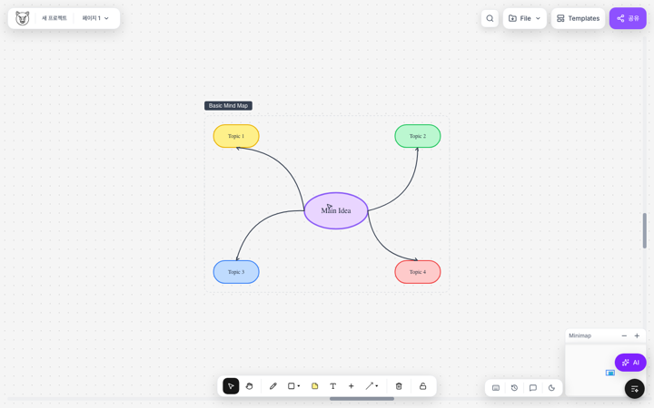
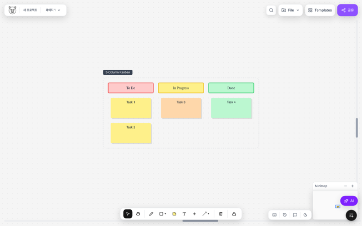

# Pig-ma

**한국어** | [English](README.en.md)

React 애플리케이션에 삽입할 수 있는 FigJam 스타일 무한 캔버스 라이브러리입니다.
도형과 커넥터, 리치 텍스트, 댓글, 차트, 외부 포맷 연동을 하나의 캔버스에서 제공합니다.

`pig-ma`는 기능 구현에 머무르지 않고 npm 패키지로 배포해 다른 React 프로젝트에서도
사용할 수 있습니다. 내부 설계와 선택 이유는
[`아키텍처 문서`](docs/ARCHITECTURE.md)에서 확인할 수 있습니다.

## 스크린샷

| 마인드맵                                               | 칸반 보드                                              |
| ------------------------------------------------------ | ------------------------------------------------------ |
|  |  |

## 설치

```bash
npm install pig-ma
```

`react`, `react-dom`, `konva`, `react-konva`, `@tiptap/*` 패키지는 peer dependency입니다.
npm 7 이상에서는 함께 설치되며, pnpm이나 Yarn Classic을 사용한다면 애플리케이션에
직접 설치해야 합니다. 애플리케이션이 이미 Konva 또는 Tiptap을 사용하고 있을 때는
동일한 의존성을 공유합니다.

## 빠른 시작

```tsx
import { Canvas, Toolbar, ZoomControls, useKeyboardShortcuts } from "pig-ma";
import "pig-ma/styles.css";

function App() {
  useKeyboardShortcuts();

  return (
    <div className="h-screen w-screen">
      <Canvas />
      <Toolbar />
      <ZoomControls />
    </div>
  );
}
```

## 주요 기능

- **무한 캔버스**: 패닝과 확대·축소, 미니맵, 그리드 기반 탐색
- **리치 텍스트**: 굵게, 취소선, 링크, 글꼴과 크기 등 인라인 서식 편집
- **도형과 차트**: 기본 도형, 메모지, 표, 코드 블록, 차트와 20종 이상의 플로우차트 도형
- **커넥터**: 직선·곡선·꺾은선과 도형 앵커 자동 연결
- **드로잉**: 펜, 마커, 형광펜을 이용한 자유 그리기
- **댓글과 반응**: 스레드형 댓글, 멘션, 이미지 첨부와 반응 표시
- **편집 도구**: 단축키, 실행 취소·다시 실행, 다중 선택 정렬과 균등 배치
- **저장과 복원**: `localStorage` 자동 저장, 프로젝트 열기 전 백업, `.pigma` 파일 저장·불러오기
- **외부 포맷 연동**: Excalidraw 양방향 변환, Mermaid 플로우차트 가져오기, Figma 가져오기·내보내기

## 공개 컴포넌트

### 기본 구성

| 컴포넌트       | 역할                                                 |
| -------------- | ---------------------------------------------------- |
| `Canvas`       | 객체 렌더링과 포인터 상호작용을 담당하는 무한 캔버스 |
| `Toolbar`      | 도구를 선택하는 하단 도구 모음                       |
| `ZoomControls` | 확대·축소 조작부                                     |
| `Header`       | 프로젝트 이름과 메뉴를 표시하는 상단 영역            |

### 캔버스 객체

| 컴포넌트      | 역할                                                        |
| ------------- | ----------------------------------------------------------- |
| `Shape`       | 기본 도형과 플로우차트 도형을 렌더링                        |
| `StickyNote`  | 리치 텍스트를 지원하는 메모지                               |
| `TextBox`     | 자유 배치형 텍스트 박스                                     |
| `Connector`   | 도형을 잇는 커넥터와 화살표                                 |
| `Line`        | 자유 그리기로 만든 선                                       |
| `CanvasImage` | 캔버스 이미지                                               |
| `Chart`       | 막대·선·원형 차트                                           |
| `Table`       | 표                                                          |
| `CodeBlock`   | 구문 강조를 지원하는 코드 블록                              |
| `Embed`       | YouTube·Figma·Notion 임베드                                 |
| `Rectangle`   | **사용 중단 예정**. `Shape`의 `rectangle` variant 사용 권장 |

> 독립된 `Circle` 컴포넌트는 제공하지 않습니다. 원은
> `<Shape shapeVariant="circle" ... />`로 렌더링하거나
> `createCircle(x, y, settings)`로 생성할 수 있습니다.

### 편집 UI

| 컴포넌트              | 역할                    |
| --------------------- | ----------------------- |
| `TextOptionsBar`      | 텍스트 서식 도구 모음   |
| `ShapeOptionsBar`     | 도형 스타일 도구 모음   |
| `ConnectorOptionsBar` | 커넥터 스타일 도구 모음 |
| `ShapesPanel`         | 도형 선택 패널          |
| `ContextMenu`         | 우클릭 메뉴             |
| `CaptionPanel`        | 댓글 목록 패널          |

## Figma 가져오기

Figma 파일의 도형을 캔버스로 가져올 수 있습니다.

```tsx
import { FigmaImportModal } from "pig-ma";

// 또는 API를 직접 호출합니다.
import {
  fetchFile,
  extractLeafNodes,
  figmaToPigma,
  parseFigmaFileUrl,
} from "pig-ma";

const fileKey = parseFigmaFileUrl("https://www.figma.com/design/...");
const file = await fetchFile(fileKey, "figd_your_token");
const nodes = extractLeafNodes(file.document);
const shapes = nodes.map(figmaToPigma).filter(Boolean);
```

`file_content:read` 권한이 있는 Figma Personal Access Token이 필요합니다.
Rectangle, Ellipse, Text, Sticky Note, Frame을 가져올 수 있습니다.

## 훅

```tsx
import {
  useKeyboardShortcuts,
  useImageDrop,
  useHistoryStore,
  useShortcutsStore,
} from "pig-ma";
```

| 훅                       | 역할                       |
| ------------------------ | -------------------------- |
| `useKeyboardShortcuts()` | 키보드 단축키 활성화       |
| `useImageDrop()`         | 이미지 드래그 앤 드롭 처리 |
| `useHistoryStore`        | 저장·불러오기 이력 접근    |
| `useShortcutsStore`      | 키보드 단축키 설정         |

## 스토어와 상태

```tsx
import {
  useCanvasStore,
  useObjects,
  useSelectedIds,
  useTool,
  useViewport,
  undo,
  redo,
} from "pig-ma";
```

### 선택자

| 선택자               | 반환값             |
| -------------------- | ------------------ |
| `useObjects()`       | 전체 캔버스 객체   |
| `useSelectedIds()`   | 선택한 객체 ID     |
| `useTool()`          | 현재 활성화된 도구 |
| `useViewport()`      | 뷰포트 위치와 배율 |
| `usePenSettings()`   | 펜과 그리기 설정   |
| `useShapeSettings()` | 기본 도형 설정     |
| `useCaptions()`      | 전체 댓글 스레드   |

### 액션

```tsx
const store = useCanvasStore();

// Objects
store.addObject(object);
store.updateObject(id, updates);
store.deleteObjects([id1, id2]);   // note: plural — there is no deleteObject(id)
store.deleteSelected();

// Selection
store.setSelectedIds([id1, id2]);
store.clearSelection();

// Tools
store.setTool('select' | 'hand' | 'pencil' | 'shape' | ...);

// Viewport
store.setViewport({ x, y, zoom });

// History
undo();
redo();
```

## 객체 생성 함수

모든 생성 함수는 `CanvasObject`를 반환합니다. 반환값을 `store.addObject()`에 전달해
캔버스에 추가합니다.

```tsx
import {
  createStickyNote,
  createShape,
  createTextBox,
  useCanvasStore,
} from "pig-ma";

const store = useCanvasStore.getState();

// Sticky note at (100, 100) — 3rd arg is a background colour, not an options object
store.addObject(createStickyNote(100, 100, "#FEF08A"));

// Any shape variant (rectangle, circle, ellipse, diamond, flowchart shapes, ...)
store.addObject(createShape(100, 300, "circle", store.shapeSettings));

store.addObject(createTextBox(100, 500));
```

| 생성 함수                                        | 호출 형태                                                               |
| ------------------------------------------------ | ----------------------------------------------------------------------- |
| `createShape`                                    | `(x, y, variant: ShapeVariant, settings: ShapeSettings, author?)`       |
| `createRectangle`                                | `(x, y, settings: ShapeSettings, author?)` — delegates to `createShape` |
| `createStickyNote`                               | `(x, y, backgroundColor?, author?)`                                     |
| `createTextBox`                                  | `(x, y, author?)`                                                       |
| `createLine`                                     | `(x, y, points: number[], settings: PenSettings)`                       |
| `createImage`                                    | `(x, y, src, width, height)`                                            |
| `createConnector`                                | `(sourceId, targetId, sourceAnchor, targetAnchor)`                      |
| `createArrow`                                    | `(startX, startY, endX, endY, options?)`                                |
| `createCodeBlock` · `createEmbed` · `cloneShape` | 자세한 내용은 `docs/API.md` 참고                                        |

`createCircle`은 `createShape(x, y, 'circle', settings)`를 간단히 호출하기 위한 편의 함수입니다.

## 타입

```tsx
import type {
  CanvasObject,
  Tool,
  ShapeVariant,
  TextSegment,
  CaptionThread,
  PenSettings,
  ShapeSettings,
} from "pig-ma";
```

## 키보드 단축키

도구 단축키는 `useShortcutsStore`에서 변경할 수 있습니다. 아래 표는 기본값입니다.

| 키                     | 동작           |
| ---------------------- | -------------- |
| `V`                    | 선택 도구      |
| `H`                    | 손 도구(이동)  |
| `R`                    | 도형 도구      |
| `P`                    | 펜 도구        |
| `E`                    | 지우개         |
| `S`                    | 메모지         |
| `T`                    | 텍스트 박스    |
| `L`                    | 커넥터         |
| `K`                    | 차트           |
| `Delete` / `Backspace` | 선택 객체 삭제 |
| `Cmd/Ctrl + Z`         | 실행 취소      |
| `Cmd/Ctrl + Shift + Z` | 다시 실행      |

고정 단축키는 변경할 수 없습니다.

| 키                     | 동작                                       |
| ---------------------- | ------------------------------------------ |
| `Cmd/Ctrl + A`         | 잠금 객체를 제외하고 전체 선택             |
| `Cmd/Ctrl + C` / `+ V` | 복사·붙여넣기(시스템 클립보드 이미지 포함) |
| `Cmd/Ctrl + Shift + R` | 붙여넣어 교체                              |
| `Cmd/Ctrl + G`         | 선택 객체 그룹화                           |
| `[` / `]`              | 맨 뒤로 보내기·맨 앞으로 가져오기          |
| `Cmd/Ctrl + S`         | 저장                                       |
| `Cmd/Ctrl + L`         | 캔버스 잠금(잠금 중에는 손 도구만 사용)    |
| `Cmd/Ctrl + /`         | 화면 UI 표시 전환                          |
| `Cmd/Ctrl + F`         | 검색(`SearchPanel`에서 처리)               |
| `Arrow keys`           | 선택 객체 1px 이동                         |
| `Shift + Arrow`        | 선택 객체 10px 이동                        |
| `Escape`               | 현재 작업 취소                             |

### 호스트 애플리케이션에서 처리할 단축키

`C`(댓글 추가)와 `/`(커서 채팅)는 라이브러리 내부에서 화면을 직접 열지 않습니다.
`useKeyboardShortcuts`가 window `CustomEvent`를 보내면 호스트 애플리케이션이
표시할 UI를 결정합니다. `src/App.tsx`의 데모에서 연결 방법을 확인할 수 있습니다.

## 사용자 정의 이벤트 연동

캔버스 트리 밖에 있는 패널과 연결할 수 있도록 window `CustomEvent`를 사용합니다.
호스트 애플리케이션은 필요한 이벤트만 구독하면 됩니다.

| 이벤트                                      | 발생 시점                    | 일반적인 처리                            |
| ------------------------------------------- | ---------------------------- | ---------------------------------------- |
| `open-caption-input`                        | 객체 선택 후 `C` 입력        | 댓글 입력창 열기                         |
| `toggle-mention-panel`                      | 멘션 패널 전환               | 앱에서 제공하는 `MentionPanel` 표시 전환 |
| `open-export-panel`                         | 내보내기 요청                | `ExportPanel` 열기                       |
| `canvas-unlock-request`                     | 잠긴 캔버스에서 `Cmd+L` 입력 | `UnlockConfirmDialog` 열기               |
| `chart-edit-title` / `codeblock-edit-title` | 제목 더블 클릭               | 인라인 제목 편집기 열기                  |
| `alignment-guides-update`                   | 드래그 중                    | 정렬 안내선 표시                         |

```tsx
useEffect(() => {
  const onCaption = (e: Event) =>
    openCaptionComposer((e as CustomEvent).detail);
  window.addEventListener("open-caption-input", onCaption);
  return () => window.removeEventListener("open-caption-input", onCaption);
}, []);
```

## 스타일 적용

라이브러리에서 제공하는 스타일 파일을 애플리케이션 진입점에서 불러옵니다.

```tsx
import "pig-ma/styles.css";
```

Tailwind를 사용하는 애플리케이션에서는 필요에 따라 Pig-ma 소스 경로를 content
설정에 추가할 수 있습니다.

## 개발 환경

이 저장소에는 배포 라이브러리와 데모 애플리케이션이 함께 있습니다.

```bash
npm install
npm run dev          # demo app on port 3874
npm run dev -- --port 5000   # test server (Playwright specs expect this port)

npm run build        # demo app build
npm run build:lib    # library build (dist/) + type declarations
npm run lint
npm test             # Vitest 단위 테스트
npm run test:watch

npx playwright test  # E2E specs in tests/
```

### 꺾은선 경로 계산

꺾은선 커넥터는 앵커의 바깥 방향으로 출발하고 대상 앵커 방향으로 진입합니다.
두 연결선 시작부는 가로·세로 선분으로 이어집니다. 두 앵커가 서로 반대 방향을 보거나
대상이 시작점 뒤에 있을 때는 도형을 가로지르지 않고 바깥쪽으로 우회합니다.

도형 크기를 전달하면 크기에 맞춰 우회 거리를 계산합니다. 도형 크기 없이 기본값
50px만 사용하면 큰 도형을 가로지를 수 있습니다.

```tsx
calculateElbowPath(start, end, bends, "sharp", 8, sourceAnchor, targetAnchor, {
  sourceSize: { width: 100, height: 60 },
  targetSize: { width: 100, height: 60 },
});
```

`Connector`는 `sourceObject`와 `targetObject`에서 이 값을 자동으로 전달합니다.
`src/utils/elbowPath.test.ts`에서 경로가 양쪽 도형 내부로 진입하지 않는지 검증합니다.

### 저장소 구조

| 경로            | 내용                                                          |
| --------------- | ------------------------------------------------------------- |
| `src/`          | 라이브러리와 데모 소스([아키텍처](docs/ARCHITECTURE.md) 참고) |
| `src/figma/`    | Figma REST 클라이언트, 변환기, 가져오기·내보내기              |
| `figma-plugin/` | 내보낸 JSON을 붙여넣는 FigJam 플러그인                        |
| `tests/`        | Playwright E2E 시나리오                                       |
| `docs/`         | 아키텍처·API·타입·도구 문서                                   |
| `docs/plans/`   | 진행 중인 설계·리팩터링 계획                                  |

### 문서

| 문서                                         | 내용                                                        |
| -------------------------------------------- | ----------------------------------------------------------- |
| [docs/README.md](docs/README.md)             | 문서 목록과 기능 개요                                       |
| [docs/ARCHITECTURE.md](docs/ARCHITECTURE.md) | 객체 모델, 레이어, 뷰포트, 드래그, 그리드 가상화, 성능 설계 |
| [docs/API.md](docs/API.md)                   | 공개 API                                                    |
| [docs/TYPES.md](docs/TYPES.md)               | 타입 레퍼런스                                               |
| [docs/TOOLS.md](docs/TOOLS.md)               | 도구별 사용법                                               |
| [CLAUDE.md](CLAUDE.md)                       | 저장소 작업 규칙                                            |
| [docs/plans/](docs/plans/)                   | 진행 중인 계획과 점검 목록                                  |
| [docs/archive/](docs/archive/README.md)      | 완료된 계획 기록. 현재 코드와 다를 수 있음                  |
| [docs/proposals/](docs/proposals/README.md)  | 검토했지만 적용하지 않은 설계                               |

### 테스트 구성

| Suite                                        | Covers                                                                                        |
| -------------------------------------------- | --------------------------------------------------------------------------------------------- |
| `src/utils/elbowPath.test.ts`                | Connector routing — anchor normals, shape crossing, backtracking, segment axis classification |
| `src/utils/geometry.test.ts`                 | Bounds, anchors, rect predicates, viewport virtualization                                     |
| `src/utils/alignment.test.ts`                | Alignment guides, connector snap / dead zone                                                  |
| `src/utils/table.structure.test.ts`          | Table row/column insert, delete, reorder — cell-key remapping invariants                      |
| `src/utils/table.test.ts`                    | Canvas ↔ editor cell content box parity                                                       |
| `src/store/core.test.ts`                     | Object CRUD, selection, canvas bounds growth, connector label cleanup                         |
| `src/store/table.test.ts`                    | Table slice — sizing sync, editing-cell reindexing, auto-fit row height                       |
| `src/utils/applyBends.test.ts`               | Stored-bend path building — staircases, out-of-range coords, reversed layouts                 |
| `src/utils/factory.test.ts`                  | Object factories — valid bounds, id uniqueness, clone isolation                               |
| `src/utils/richText.test.ts`                 | Segment merge/split/toggle — text is never altered by styling                                 |
| `src/store/clipboard.test.ts`                | Copy/paste id remapping, connector + label rewiring, z-order, lock                            |
| `src/store/groups.test.ts`                   | Grouping, regrouping cleanup, ungroup, group move, metadata                                   |
| `src/utils/migrateConnectorGeometry.test.ts` | Legacy connector geometry migration (v4→v5)                                                   |
| `src/figma/__tests__/mapper.test.ts`         | Figma node mapping                                                                            |

스토어 테스트는 `src/test/setup.ts`의 최소 `localStorage` 대역을 사용해 Node에서
실행하므로 jsdom이 필요하지 않습니다.

## 필수 동료 의존성

- React 18 또는 19
- React DOM 18 또는 19

## 라이선스

MIT
