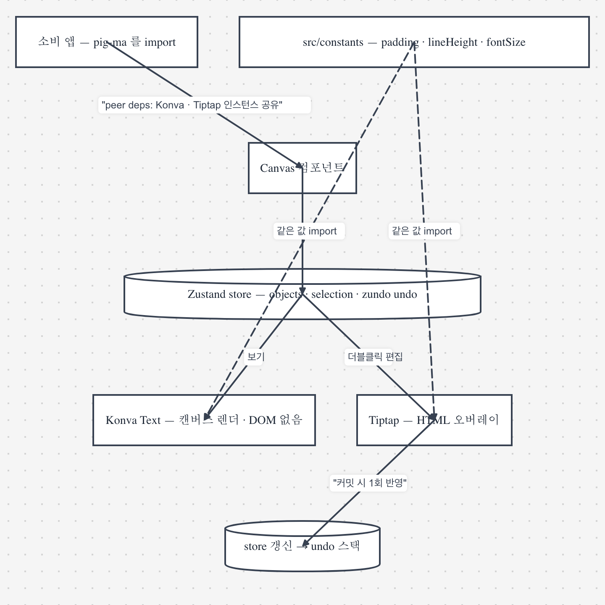

# 아키텍처

## 개요

Pig-ma는 React와 Konva를 기반으로 구현한 무한 캔버스 라이브러리입니다.
Figma와 FigJam의 조작 방식을 참고하되, npm 패키지로 삽입할 수 있도록
캔버스 엔진과 데모 애플리케이션을 분리했습니다.

텍스트는 보기 모드에서 Konva로 렌더링하고 편집 모드에서 Tiptap으로 처리합니다.
두 경로는 `src/constants`의 같은 설정을 사용해 글꼴과 줄 높이 차이를 줄입니다.



> 이 다이어그램은 Pig-ma의 Mermaid 가져오기 기능으로 만들었습니다.
> 원본 정의는 [`diagrams/text-render-flow.mmd`](diagrams/text-render-flow.mmd).

## 핵심 구조

### 1. 단일 객체 모델

모든 캔버스 객체는 `CanvasObject` 인터페이스로 저장합니다. 공통 필드와 타입별
선택 필드를 한 객체에 두어 파일 저장과 마이그레이션 경로를 단순하게 유지합니다.

```typescript
interface CanvasObject {
  id: string
  type: ObjectType  // 'rectangle' | 'circle' | 'connector' | ...
  x: number
  y: number
  rotation: number
  opacity: number

  // Type-specific optional fields
  width?: number
  height?: number
  radius?: number     // circle
  points?: number[]   // line
  sourceId?: string   // connector
  // ...
}
```

이 구조는 직렬화와 기존 `.pigma` 파일 호환에는 유리하지만, 객체 종류와 무관한
선택 필드가 함께 노출되는 한계가 있습니다. 타입별 `props` 분리안은
[`proposals/canvas-object-props-separation.md`](proposals/canvas-object-props-separation.md)에
검토 기록으로 남겨두었으며 현재 구조로 채택되지는 않았습니다.

### 2. 레이어 구성

Canvas는 4개의 Konva Layer로 이루어져 있습니다:

```
┌─────────────────────────────────────┐
│  Layer 4: Drawing Layer             │  ← 펜슬, 미리보기, 선택 사각형
├─────────────────────────────────────┤
│  Layer 3: Connectors Layer          │  ← 연결 핸들, 호버 포인트
├─────────────────────────────────────┤
│  Layer 2: Objects Layer             │  ← 도형, 커넥터 (Z-order 존중)
├─────────────────────────────────────┤
│  Layer 1: Grid Layer                │  ← 배경 그리드 도트
└─────────────────────────────────────┘
```

**Z-order 동작:**
- `objects` 배열의 순서가 그대로 렌더링 순서입니다
- `bringToFront()`: 배열 끝으로 이동시킵니다
- `sendToBack()`: 배열 앞으로 이동시킵니다
- 커넥터도 일반 객체와 같은 레이어에서 렌더링됩니다 (Z-order 존중)

### 3. 뷰포트

무한 캔버스는 viewport 변환으로 구현되어 있습니다:

```typescript
interface Viewport {
  x: number      // 패닝 offset
  y: number
  zoom: number   // 줌 레벨 (0.1 ~ 10)
}
```

**좌표 변환:**
```typescript
// 화면 좌표 → 캔버스 좌표
const canvasX = (screenX - viewport.x) / viewport.zoom
const canvasY = (screenY - viewport.y) / viewport.zoom

// 캔버스 좌표 → 화면 좌표
const screenX = canvasX * viewport.zoom + viewport.x
const screenY = canvasY * viewport.zoom + viewport.y
```

**줌 동작이 Figma 스타일입니다:**
- `Cmd + 스크롤`: 줌 인/아웃
- `스크롤만`: 패닝 (2배속)

### 4. 상태 관리

Zustand + zundo + persist 조합을 사용하고 있습니다:

```typescript
const useCanvasStore = create(
  temporal(           // undo/redo
    persist(          // localStorage
      (set) => ({
        objects: [],
        selectedIds: [],
        viewport: { x: 0, y: 0, zoom: 3 },
        // ...
      })
    )
  )
)
```

**Undo/Redo 동작:**
- `equality` 함수로 의미 있는 변경만 히스토리에 저장합니다
- 미세한 위치 변경 (< 1px), 높이 변경 (< 5px) 무시합니다
- ID 추가/삭제, 텍스트 변경 같은 건 저장됩니다

### 5. 드래그 조정자

드래그 중 발생하는 고빈도 좌표 변경은 React 상태를 매번 갱신하지 않고
`dragCoordinator`가 Konva 노드에 직접 전달합니다. 드래그가 끝날 때 최종 좌표만
스토어에 반영해 렌더링 횟수와 히스토리 항목 증가를 줄입니다.

```typescript
// 드래그 중에는 store 업데이트 없이 Konva를 직접 업데이트합니다
onDragMove: (e) => {
  dragCoordinator.setPosition(obj.id, e.target.x(), e.target.y())
}

// 드래그 끝날 때만 store 업데이트합니다
onDragEnd: (e) => {
  dragCoordinator.clear(obj.id)
  updateObject(obj.id, { x: e.target.x(), y: e.target.y() })
}

// Connector가 shape 드래그를 구독하면서 실시간으로 따라갑니다
useEffect(() => {
  if (!connector.sourceId) return
  return dragCoordinator.subscribe(connector.sourceId, (pos) => {
    setLiveSourcePos(pos)  // Konva 노드 직접 업데이트합니다
  })
}, [connector.sourceId])
```

### 6. 그리드 가상화

줌 레벨에 따라 적응형 그리드를 구현했습니다:

```typescript
// 화면 공간 기준 일정 밀도 유지 (약 20px 간격)
const targetScreenGap = 20
const rawGap = targetScreenGap / viewport.zoom
const gap = Math.min(500, Math.max(10, Math.round(rawGap / 10) * 10))
```

**줌별 그리드 간격:**
| 줌 레벨 | 캔버스 간격 | 화면 간격 |
|---------|-------------|-----------|
| 0.1x | 200px | 20px |
| 1x | 20px | 20px |
| 10x | 10px | 100px |

## 성능 최적화

### 1. React.memo

모든 Shape 컴포넌트를 `memo()`로 래핑했습니다:

```typescript
export const Rectangle = memo(function Rectangle({ ... }) {
  // ...
})
```

### 2. `useMemo`를 이용한 필터링

객체 타입별 필터링 결과를 캐싱합니다:

```typescript
const lineObjects = useMemo(
  () => objects.filter((obj) => obj.type === 'line'),
  [objects]
)
```

### 3. `objectsById` 맵

O(1) 객체 조회를 위해 Map을 사용합니다:

```typescript
const objectsById = useMemo(() => {
  const map = new Map<string, CanvasObject>()
  objects.forEach((obj) => map.set(obj.id, obj))
  return map
}, [objects])
```

### 4. Konva 성능 속성

```typescript
<Rect
  perfectDrawEnabled={false}      // 안티앨리어싱 비용을 줄입니다
  shadowForStrokeEnabled={false}  // 그림자 계산을 비활성화합니다
  listening={false}               // 이벤트가 불필요할 때 사용합니다
/>
```

## 컴포넌트 통신

### 속성은 하위 컴포넌트로, 이벤트는 상위 컴포넌트로 전달

```
App
 └─ Canvas
     ├─ Toolbar (도구 선택, 설정)
     ├─ Objects Layer
     │   ├─ Rectangle
     │   ├─ Circle
     │   ├─ Connector
     │   └─ ...
     ├─ ContextMenu
     └─ TextBoxEditor
```

### 상태의 기준은 스토어로 통일

- 캔버스 객체와 페이지, 선택 상태는 Zustand 스토어에서 관리합니다.
- 컴포넌트는 렌더링에 필요한 상태만 selector로 구독합니다.
- 호버와 임시 편집 상태처럼 저장할 필요가 없는 값은 컴포넌트 내부에 둡니다.

## 이벤트 흐름

### 마우스 이벤트

```
Stage.onMouseDown
  → 도구별로 핸들링을 분기합니다
  → select: 마키 선택을 시작합니다
  → pencil: 드로잉을 시작합니다
  → connector: 화살표를 시작합니다
  → shape tools: 객체를 생성합니다

Stage.onMouseMove
  → 마키를 업데이트합니다
  → 드로잉 포인트를 추가합니다
  → 화살표 엔드포인트를 업데이트합니다
  → 마우스 위치를 저장합니다 (붙여넣기용)

Stage.onMouseUp
  → 마키 선택을 완료합니다
  → 드로잉 완료 → 객체를 생성합니다
  → 화살표 완료 → 커넥터를 생성합니다
```

### 키보드 이벤트

```
useKeyboardShortcuts hook
  → 도구 단축키를 처리합니다 (V, H, P, R, S, L, T, C)
  → 편집 단축키를 처리합니다 (Cmd+Z, Cmd+Shift+Z, Cmd+C, Cmd+V)
  → 조작 단축키를 처리합니다 (], [, Cmd+L)
  → 이동 단축키를 처리합니다 (Arrow keys)
```

## 파일 입출력과 포맷 변환

캔버스 상태와 외부 포맷 사이의 변환은 **순수 변환 함수와 스토어 적용부**로
분리했습니다. 변환 함수는 파일 형식만 다루고, 화면 배치와 상태 반영은 별도
함수에서 처리합니다.

| 모듈 | 방향 | 핵심 함수 | 비고 |
|------|------|----------|------|
| `utils/pigmaFile.ts` | 저장/열기 | `buildPigmaFile` / `parsePigmaFile` (순수) + `applyPigmaFile` (store) | 프로젝트 전체(pages[]) 직렬화. 열기 시 localStorage 자동 백업 → `restoreBackup()` 스왑 복원 |
| `src/excalidraw/` | 양방향 | `convertExcalidraw` / `convertToExcalidraw` (순수) + `importExcalidrawToCanvas` | 바인딩↔sourceId, frame↔customBounds 그룹. export 시 chart/codeBlock/table/embed 는 `Konva.stages[0]` 래스터화 |
| `src/mermaid/` | import | `parseMermaid` → `layoutGraph` → `convertMermaid` | flowchart 서브셋 자체 파서 + Kahn 위상정렬 레이아웃. 외부 의존성 없음 |
| `src/figma/` | 양방향 | `figmaToPigma` / `pigmaToFigma` | REST API(PAT). characterStyleOverrides ↔ Tiptap, 폰트 실측 매핑 |

공통 규칙은 다음과 같습니다.

- 변환 함수에서는 스토어에 접근하지 않습니다. 단위 테스트도 변환 함수를 기준으로 작성합니다.
- 가져오기는 기존 캔버스에 객체를 추가하고 뷰포트 중앙에 배치합니다.
- `.pigma` 파일 열기만 현재 프로젝트를 교체하며, 교체 전에 자동 백업을 만듭니다.
- `FileMenu.tsx`와 `useImageDrop.ts`가 파일 선택과 드래그 앤 드롭을 확장자별로 분기합니다.
- 완료 여부와 가져온 객체 수는 공용 토스트로 안내합니다.

## 확장 지점

### 새 도형 타입 추가할 때

1. `types.ts`에서 `ObjectType`에 타입을 추가합니다
2. `utils/factory.ts`에 생성 함수를 작성합니다
3. `components/shapes/`에 컴포넌트를 생성합니다
4. `Canvas.tsx`에 switch case를 추가합니다

### 새 도구 추가할 때

1. `types.ts`에 `Tool` 타입을 추가합니다
2. `Toolbar.tsx`에 버튼을 추가합니다
3. `Canvas.tsx`에 마우스 이벤트 핸들러를 추가합니다
4. `useKeyboardShortcuts.ts`에 단축키를 추가합니다 (선택사항)
