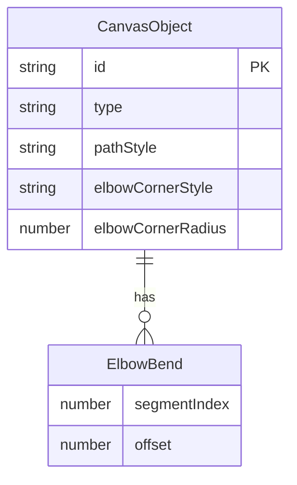

# feat: Elbow Connector Midpoint Handle Enhancement

## Overview

Elbowed 커넥터의 직선 구간에 드래그 가능한 미드포인트 핸들을 추가하여, 사용자가 라인의 경로를 직관적으로 조정할 수 있게 합니다. Figma/FigJam의 커넥터 편집 방식과 유사한 UX를 제공합니다.

## Problem Statement / Motivation

현재 `elbowed` 경로 스타일은 단순 L자 형태의 고정 경로만 지원합니다:
```
[startX, startY, midX, startY, midX, endY, endX, endY]
```

사용자가 다이어그램에서 복잡한 연결선을 그릴 때:
- 장애물을 피해 라인을 우회해야 하는 경우
- 시각적으로 더 깔끔한 라우팅이 필요한 경우
- ㄷ, ㄹ, U 형태의 복잡한 경로가 필요한 경우

현재 구조로는 이를 표현할 수 없습니다.

## Proposed Solution

각 직선 세그먼트의 1/2 지점에 파란색 미드포인트 핸들을 표시하고, 이를 드래그하면 해당 세그먼트가 두 개로 분할되며 새로운 꺾임점이 생성됩니다.

**핵심 동작:**
1. Elbowed 커넥터 선택 시 각 직선 구간 중앙에 파란색 핸들 표시
2. 핸들 드래그 → 해당 세그먼트가 2개로 분리 (직각 또는 둥근 모서리)
3. 세그먼트당 1개의 추가 꺾임만 허용 (무한 분할 방지)

## Technical Approach

### 데이터 모델 확장

`types.ts`의 `CanvasObject`에 새 필드 추가:

```typescript
// types.ts
export interface CanvasObject {
  // ... existing fields ...

  // Elbow connector bend points (세그먼트별 오프셋)
  elbowBends?: ElbowBend[]
  // Corner style for elbowed connectors
  elbowCornerStyle?: 'sharp' | 'rounded'
  elbowCornerRadius?: number  // rounded일 때 반지름 (기본 8px)
}

export interface ElbowBend {
  segmentIndex: number  // 어떤 세그먼트에 bend가 있는지
  offset: number        // 세그먼트 방향으로의 offset (px)
}
```

### 세그먼트 계산 로직

```
기본 elbowed 경로 (L자):
  Segment 0: start → corner1 (수평)
  Segment 1: corner1 → corner2 (수직)
  Segment 2: corner2 → end (수평)

Bend 추가 후 (ㄷ자):
  Segment 0: start → corner1
  Segment 1-a: corner1 → bend1
  Segment 1-b: bend1 → corner2
  Segment 2: corner2 → end
```

### 구현 순서

#### Phase 1: 데이터 모델 & 경로 계산

**파일: `src/types.ts`**
- [x] `ElbowBend` 인터페이스 추가
- [x] `CanvasObject`에 `elbowBends`, `elbowCornerStyle`, `elbowCornerRadius` 필드 추가

**파일: `src/utils/elbowPath.ts` (신규)**
```typescript
// 핵심 함수들
export function calculateElbowPath(
  start: Point,
  end: Point,
  bends: ElbowBend[],
  cornerStyle: 'sharp' | 'rounded',
  cornerRadius: number
): number[]

export function getSegments(points: number[]): Segment[]

export function getMidpointHandlePositions(segments: Segment[]): Point[]

export function canAddBend(segmentIndex: number, bends: ElbowBend[]): boolean
```

#### Phase 2: Connector 렌더링 수정

**파일: `src/components/shapes/Connector.tsx`**
- [x] `calculatePathPoints` 함수를 `elbowBends` 지원하도록 확장
- [x] 둥근 모서리 렌더링 (SVG quadratic curve 또는 Konva arc)
- [x] 미드포인트 핸들 렌더링 (파란색 원형)
- [x] 핸들 드래그 이벤트 처리

```tsx
// 미드포인트 핸들 렌더링 예시
{isSelected && pathStyle === 'elbowed' && (
  <>
    {midpointHandles.map((handle, idx) => (
      <Circle
        key={`midpoint-${idx}`}
        x={handle.x}
        y={handle.y}
        radius={5 / zoom}
        fill="#0D99FF"
        stroke="white"
        strokeWidth={2 / zoom}
        draggable={canAddBend(handle.segmentIndex)}
        onDragMove={(e) => handleMidpointDrag(e, handle.segmentIndex)}
        onDragEnd={(e) => handleMidpointDragEnd(e, handle.segmentIndex)}
      />
    ))}
  </>
)}
```

#### Phase 3: Options Bar UI 확장

**파일: `src/components/ConnectorOptionsBar.tsx`**
- [x] Corner Style 옵션 추가 (Sharp / Rounded)
- [ ] Corner Radius 슬라이더 (rounded 선택 시) - 추후 구현

```tsx
const CORNER_STYLE_OPTIONS = [
  { id: 'sharp', icon: CornerSquare, label: 'Sharp' },
  { id: 'rounded', icon: CornerRound, label: 'Rounded' },
]
```

### Acceptance Criteria

**Functional Requirements**
- [ ] Elbowed 커넥터 선택 시 각 직선 세그먼트 중앙에 파란색 핸들 표시
- [ ] 미드포인트 핸들 드래그 시 새로운 꺾임점 생성
- [ ] 세그먼트당 최대 1개의 추가 꺾임만 허용
- [ ] Sharp/Rounded 코너 스타일 전환 가능
- [ ] Rounded 스타일의 반지름 조절 가능

**Non-Functional Requirements**
- [ ] 드래그 중 60fps 유지 (Konva 직접 조작)
- [ ] 기존 elbowed 커넥터와 하위 호환성 유지
- [ ] 줌 레벨에 관계없이 핸들 크기 일정 (`radius / zoom`)

**Quality Gates**
- [x] 기존 Connector 테스트 통과 (테스트 없음)
- [ ] 새 미드포인트 핸들 테스트 추가 - 추후 구현
- [x] TypeScript 타입 에러 없음

## MVP Implementation

### elbowPath.ts

```typescript
import type { ElbowBend } from '@/types'

interface Point {
  x: number
  y: number
}

interface Segment {
  start: Point
  end: Point
  index: number
  direction: 'horizontal' | 'vertical'
}

/**
 * 기본 elbowed 경로 포인트 계산 (bends 없이)
 */
function getBaseElbowPoints(start: Point, end: Point): Point[] {
  const midX = (start.x + end.x) / 2
  return [
    start,
    { x: midX, y: start.y },
    { x: midX, y: end.y },
    end,
  ]
}

/**
 * Bends를 적용한 최종 경로 계산
 */
export function calculateElbowPath(
  start: Point,
  end: Point,
  bends: ElbowBend[] = [],
  cornerStyle: 'sharp' | 'rounded' = 'sharp',
  cornerRadius: number = 8
): number[] {
  const basePoints = getBaseElbowPoints(start, end)

  // TODO: Apply bends to base points
  // TODO: Apply corner rounding if needed

  return basePoints.flatMap(p => [p.x, p.y])
}

/**
 * 세그먼트 목록 추출
 */
export function getSegments(points: number[]): Segment[] {
  const segments: Segment[] = []
  for (let i = 0; i < points.length - 2; i += 2) {
    const start = { x: points[i], y: points[i + 1] }
    const end = { x: points[i + 2], y: points[i + 3] }
    const direction = start.y === end.y ? 'horizontal' : 'vertical'
    segments.push({ start, end, index: i / 2, direction })
  }
  return segments
}

/**
 * 미드포인트 핸들 위치 계산
 */
export function getMidpointHandlePositions(
  segments: Segment[],
  existingBends: ElbowBend[]
): (Point & { segmentIndex: number; canBend: boolean })[] {
  return segments.map(seg => ({
    x: (seg.start.x + seg.end.x) / 2,
    y: (seg.start.y + seg.end.y) / 2,
    segmentIndex: seg.index,
    canBend: !existingBends.some(b => b.segmentIndex === seg.index),
  }))
}
```

### Connector.tsx 수정 부분

```tsx
// 새로운 import
import { calculateElbowPath, getSegments, getMidpointHandlePositions } from '@/utils/elbowPath'

// calculatePathPoints 수정
function calculatePathPoints(
  startX: number,
  startY: number,
  endX: number,
  endY: number,
  pathStyle: PathStyle,
  elbowBends?: ElbowBend[],
  elbowCornerStyle?: 'sharp' | 'rounded',
  elbowCornerRadius?: number
): number[] {
  switch (pathStyle) {
    case 'elbowed':
      return calculateElbowPath(
        { x: startX, y: startY },
        { x: endX, y: endY },
        elbowBends ?? [],
        elbowCornerStyle ?? 'sharp',
        elbowCornerRadius ?? 8
      )
    // ... other cases
  }
}
```

## ERD (Elbow Bend Data Model)



## References

### Internal References
- `src/components/shapes/Connector.tsx:32-56` - 현재 calculatePathPoints 함수
- `src/components/shapes/Connector.tsx:695-731` - 기존 드래그 핸들 구현
- `src/components/ConnectorOptionsBar.tsx:41-45` - PATH_STYLE_OPTIONS

### External References
- [Konva Line documentation](https://konvajs.org/api/Konva.Line.html)
- [Figma Connector behavior](https://help.figma.com/hc/en-us/articles/360040450133-Use-connectors-in-FigJam)
