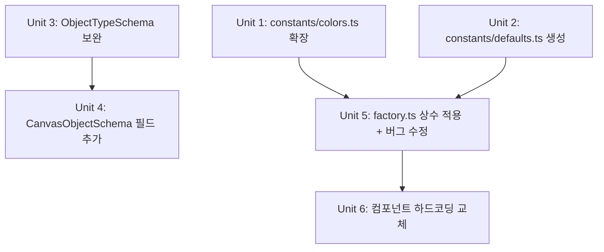

# refactor: 공통 상수 통합 및 Zod 스키마 완성

## Overview

프로젝트 전반에 산재된 매직 넘버/문자열을 `src/constants/`로 통합하고, 기존 Zod 스키마의 누락된 타입과 필드를 보완하여 런타임 타입 안정성을 강화한다.

## Problem Frame

1. **상수 산재**: 동일한 값이 여러 파일에 하드코딩되어 있어 변경 시 누락 위험이 높고, 값 불일치 버그가 이미 존재함 (factory.ts textBox fontSizePreset "M" vs fontSize 16)
2. **Zod 스키마 불완전**: `ObjectTypeSchema`에 `chart`, `codeBlock`, `embed` 타입이 누락되어 있고, 관련 필드(chartData, code 등)도 스키마에 없음. localStorage에서 로드 시 검증이 warning-only로 동작

## Requirements Trace

- R1. 하드코딩된 매직 값들을 `src/constants/`로 통합하여 단일 소스로 관리
- R2. `ObjectTypeSchema`에 누락된 타입(`chart`, `codeBlock`, `embed`) 추가
- R3. `CanvasObjectSchema`에 chart/codeBlock/embed 전용 필드 추가
- R4. factory.ts의 fontSizePreset 불일치 버그 수정
- R5. 기존 `.passthrough()` 패턴 유지 (하위 호환성)

## Scope Boundaries

- Figma API 응답 Zod 검증은 이번 범위에서 제외 (별도 작업)
- Store hydration을 warning-only에서 fail-safe로 변경하는 것은 제외
- `z.infer<>` 기반 타입 통합(types.ts 제거)은 제외 — 별도 대규모 작업
- 클립보드 붙여넣기 검증은 제외

## Context & Research

### Relevant Code and Patterns

- `src/constants/` — 기존 상수 파일 (zIndex, colors, text, table, template, zoom)
- `src/schemas/canvasObject.ts` — 기존 Zod 스키마 (`ObjectTypeSchema` 8개 타입만 정의)
- `src/schemas/index.ts` — `validatePersistedState()` 함수 존재
- `src/utils/factory.ts` — 모든 객체 생성 함수, 하드코딩 값 다수
- `src/types.ts` — TypeScript 타입 정의 (ObjectType에 11개 타입)
- `src/store/index.ts` — equality 함수에 chart/codeBlock 필드 등록됨

### 발견된 주요 문제

| 문제 | 위치 | 심각도 |
|------|------|--------|
| `STICKY_COLORS` 2곳 중복 | factory.ts, TextOptionsBar.tsx | 중 |
| CodeBlock 테마색 5+곳 하드코딩 | factory.ts, CodeBlock.tsx, CodeBlockEditor.tsx 등 | 중 |
| `"#374151"` (기본 텍스트/커넥터색) 10+곳 | factory.ts, 각종 OptionsBar | 중 |
| `"Pretendard"` 15+곳 하드코딩 | factory.ts, 각종 Editor/OptionsBar | 중 |
| 객체 기본 크기 factory.ts에만 | factory.ts | 하 |
| Pen opacity 배율 하드코딩 | factory.ts | 하 |
| `ObjectTypeSchema` 3개 타입 누락 | schemas/canvasObject.ts | 상 |
| CanvasObjectSchema chart/code 필드 없음 | schemas/canvasObject.ts | 상 |
| fontSizePreset "M" vs fontSize 16 불일치 | factory.ts:236 | 상 (버그) |

## Key Technical Decisions

- **상수 파일 구조**: 기존 `src/constants/colors.ts`를 확장하고, 새로 `defaults.ts` 파일 추가. 도메인별로 파일 분리 유지
- **Zod `.passthrough()` 유지**: 하위 호환성을 위해 기존 패턴 유지. 새 필드는 `.optional()`로 추가
- **ChartData 스키마**: `chartData`는 `z.unknown()`으로 처리. 이유: `ChartData` 내부 구조가 복잡하고(ChartDataItem, ChartSeries, LineSeriesStyle 등 중첩 타입), 현재 localStorage 검증이 warning-only이므로 정밀 스키마의 실익이 낮음. 향후 store validation을 fail-safe로 전환할 때 정밀 스키마 작성 검토
- **`CODE_THEMES` 이동 보류**: `types.ts`의 `CODE_THEMES`는 라이브러리 public API(`src/index.ts`)에 포함될 수 있으므로, 이동하지 않고 그대로 둠. 대신 `constants/colors.ts`에서 CodeBlock 컴포넌트용 테마색 상수를 별도 정의하여 하드코딩만 제거
- **types.ts ↔ schema 동기화**: 새 enum 추가 시 `types.ts`의 union 타입과 schema의 `z.enum`이 정확히 일치하는지 타입 레벨 assertion 추가 (구현 시 `satisfies` 또는 테스트로 검증)
- **상수 import 방식**: `@/constants`에서 import, 기존 패턴과 동일

## Open Questions

### Resolved During Planning

- **CODE_THEMES를 constants로 옮길지?**: 이동하지 않음. `types.ts`의 `CODE_THEMES`는 라이브러리 public API에 포함될 수 있어 이동 시 breaking change 위험. 대신 컴포넌트용 테마색 상수를 `constants/colors.ts`에 별도 정의
- **Pretendard 하드코딩 전부 교체?**: `TEXT_CONFIG`에 이미 `defaultFontFamily` 있으므로, 각 사용처에서 이를 참조하도록 변경
- **`reactions` 스키마 타입?**: `types.ts`의 `ObjectReaction[]` 구조를 반영하여 `z.array(z.unknown())`으로 정의 (`z.record()` 아님)

### Deferred to Implementation

- 15+곳의 `"Pretendard"` 교체 시 일부는 Tiptap 에디터 설정과 연관 — 실제 코드를 보고 교체 가능 여부 판단 필요
- CodeBlock 테마색 교체 시 `types.ts`의 `CODE_THEMES`와 `constants/colors.ts` 간 관계 정리

## Implementation Units

- [ ] **Unit 1: `constants/colors.ts` 확장 — 색상 상수 통합**

**Goal:** 프로젝트 전반에 하드코딩된 색상 값을 `constants/colors.ts`에 모아 단일 소스로 관리

**Requirements:** R1

**Dependencies:** None

**Files:**
- Modify: `src/constants/colors.ts`
- Modify: `src/constants/index.ts`

**Approach:**
- `STICKY_COLORS` 배열 추가 (factory.ts와 TextOptionsBar.tsx에서 중복된 값)
- `DEFAULT_STROKE_COLOR` = `"#374151"` (커넥터, 라벨, 차트 텍스트 공통)
- `CODEBLOCK_THEME_COLORS` 객체 추가 (컴포넌트에서 하드코딩된 테마 hex 값 통합, `types.ts`의 `CODE_THEMES`는 이동하지 않음)
- 기존 `CHART_COLORS` 옆에 배치

**Patterns to follow:**
- `src/constants/colors.ts` 기존 `CHART_COLORS` 패턴 (`as const` 어설션)
- `src/constants/text.ts`의 `TEXT_CONFIG` 구조

**Test scenarios:**
- Test expectation: none — 순수 상수 정의, 동작 변경 없음

**Verification:**
- 새 상수가 export되고 `@/constants`에서 import 가능

---

- [ ] **Unit 2: `constants/defaults.ts` 생성 — 객체 기본값 통합**

**Goal:** factory.ts에 하드코딩된 객체 기본 크기, 펜 설정 등을 상수로 분리

**Requirements:** R1

**Dependencies:** Unit 1 (색상 상수 참조)

**Files:**
- Create: `src/constants/defaults.ts`
- Modify: `src/constants/index.ts`

**Approach:**
- `STICKY_NOTE_DEFAULTS`, `TEXTBOX_DEFAULTS`, `CODEBLOCK_DEFAULTS`, `CHART_DEFAULTS`, `EMBED_DEFAULTS` 객체
- `CONNECTOR_DEFAULTS` (stroke, strokeWidth)
- `PEN_TYPE_CONFIG` (marker: opacity 0.7/multiplier 2, highlighter: opacity 0.4/multiplier 4)
- 기존 `TEXT_CONFIG`의 `defaultFontFamily`를 별도 `DEFAULT_FONT_FAMILY` 상수로도 export

**Patterns to follow:**
- `src/constants/table.ts`의 `TABLE_DEFAULTS` 구조

**Test scenarios:**
- Test expectation: none — 순수 상수 정의, 동작 변경 없음

**Verification:**
- 새 상수가 export되고 `@/constants`에서 import 가능
- 값이 현재 factory.ts의 하드코딩 값과 일치

---

- [ ] **Unit 3: `ObjectTypeSchema` 누락 타입 추가**

**Goal:** Zod `ObjectTypeSchema`에 `chart`, `codeBlock`, `embed` 추가하여 `types.ts`의 `ObjectType`과 동기화

**Requirements:** R2

**Dependencies:** None

**Files:**
- Modify: `src/schemas/canvasObject.ts`
- Create: `src/schemas/__tests__/canvasObject.test.ts` (현재 미존재)

**Approach:**
- `ObjectTypeSchema`의 `z.enum` 배열에 `"chart"`, `"codeBlock"`, `"embed"` 추가
- `types.ts`의 `ObjectType` union과 값이 정확히 일치하는지 타입 레벨 assertion 또는 테스트로 검증
- 테스트 파일 신규 생성 (vitest 사용 — 기존 `src/figma/__tests__/mapper.test.ts` 패턴 참조)

**Patterns to follow:**
- 기존 `ObjectTypeSchema` 정의 패턴
- `src/figma/__tests__/mapper.test.ts` 테스트 구조

**Test scenarios:**
- Happy path: `ObjectTypeSchema.parse("chart")`, `parse("codeBlock")`, `parse("embed")` 각각 성공
- Happy path: 기존 8개 타입 (`"image"`, `"line"` 등) 여전히 성공
- Error path: 존재하지 않는 타입 `"unknown"` 파싱 시 에러
- Integration: `CanvasObjectSchema`로 `type: "chart"` 객체 파싱 성공

**Verification:**
- `ObjectTypeSchema`의 enum 값이 `types.ts`의 `ObjectType` 11개와 1:1 대응
- 테스트 통과

---

- [ ] **Unit 4: `CanvasObjectSchema`에 chart/codeBlock/embed 필드 추가**

**Goal:** 현재 `.passthrough()`로 무검증 통과하는 chart/codeBlock/embed 전용 필드에 명시적 스키마 추가

**Requirements:** R3, R5

**Dependencies:** Unit 3

**Files:**
- Modify: `src/schemas/canvasObject.ts`
- Test: `src/schemas/__tests__/canvasObject.test.ts`

**Approach:**
- chart 필드: `chartData` (z.unknown — 내부 구조 복잡), `chartShowHeader` (boolean), `chartTitle` (string)
- codeBlock 필드: `code` (string), `codeLanguage` (string), `codeTitle` (string), `codeTheme` (enum)
- embed 필드: `embedUrl` (string), `embedType` (z.enum ["youtube", "figma", "notion"]), `embedMetadata` (z.unknown), `isPlaying` (boolean)
- `reactions` 필드: `z.array(z.unknown())` (types.ts의 `ObjectReaction[]` 구조 반영)
- 모든 필드 `.optional()`, `.passthrough()` 유지

**Patterns to follow:**
- 기존 `CanvasObjectSchema`의 connector/table 필드 추가 패턴
- `store/index.ts` equality 함수에 등록된 필드 목록 참조

**Test scenarios:**
- Happy path: chart 객체 (`type: "chart"`, `chartData: {...}`) 파싱 성공
- Happy path: codeBlock 객체 (`type: "codeBlock"`, `code: "..."`, `codeLanguage: "javascript"`) 파싱 성공
- Happy path: embed 객체 (`type: "embed"`, `embedUrl: "..."`) 파싱 성공
- Edge case: chart 객체에 chartData 없이도 파싱 성공 (optional)
- Edge case: codeTheme에 잘못된 값 — `.passthrough()` 때문에 통과하지만 enum 필드 자체는 기본 검증
- Integration: `validatePersistedState()`로 chart/codeBlock 포함된 전체 state 검증 성공

**Verification:**
- 테스트 통과
- 기존 `validatePersistedState()` 동작에 영향 없음

---

- [ ] **Unit 5: `factory.ts` 상수 적용 및 fontSizePreset 버그 수정**

**Goal:** factory.ts의 하드코딩 값을 새 상수로 교체하고, textBox fontSizePreset 불일치 버그 수정

**Requirements:** R1, R4

**Dependencies:** Unit 1, Unit 2

**Files:**
- Modify: `src/utils/factory.ts`

**Approach:**
- `STICKY_COLORS` → `@/constants`에서 import
- 객체 기본 크기 → `STICKY_NOTE_DEFAULTS`, `TEXTBOX_DEFAULTS` 등 사용
- `"#374151"` → `DEFAULT_STROKE_COLOR`
- `"Pretendard"` → `DEFAULT_FONT_FAMILY`
- 펜 배율 → `PEN_TYPE_CONFIG`
- **버그 수정**: line 236 `fontSizePreset: "M"` → `fontSizePreset: "S"` (fontSize 16은 S preset)
- CodeBlock 테마색 → 상수 참조

**Patterns to follow:**
- `src/constants/table.ts`의 `TABLE_DEFAULTS` 사용 패턴

**Test scenarios:**
- Happy path: `createStickyNote()` 생성 결과가 기존과 동일한 값
- Happy path: `createTextBox()` 생성 시 `fontSizePreset`이 `"S"`, `fontSize`가 16 — 일관
- Happy path: `createCodeBlock()` 생성 결과가 기존과 동일
- Happy path: `createConnector()` 생성 시 stroke가 `DEFAULT_STROKE_COLOR`와 동일
- Edge case: pen 타입별 (marker, highlighter, pen) opacity/strokeWidth 배율 기존과 동일

**Verification:**
- factory 함수가 동일한 기본값 객체를 생성 (fontSizePreset 버그만 변경)
- 기존 테스트 통과

---

- [ ] **Unit 6: 컴포넌트 하드코딩 교체**

**Goal:** OptionsBar, Editor 등 컴포넌트에서 하드코딩된 값을 상수로 교체

**Requirements:** R1

**Dependencies:** Unit 5

**Files:**
- Modify: `src/components/TextOptionsBar.tsx` (STICKY_COLORS, "#374151", "Pretendard")
- Modify: `src/components/ConnectorLabelOptionsBar.tsx` ("#374151", "Pretendard")
- Modify: `src/components/ChartOptionsBar.tsx` ("#374151")
- Modify: `src/components/ChartRightPanel.tsx` ("#374151")
- Modify: `src/components/ShapeOptionsBar.tsx` ("Pretendard")
- Modify: `src/components/shapes/CodeBlock.tsx` (테마색)
- Modify: `src/components/CodeBlockEditor.tsx` (테마색)
- Modify: `src/components/CodeBlockViewerOverlay.tsx` (테마색)
- Modify: `src/store/slices/drawing.ts` ("#fef08a")
- Modify: `src/contexts/ToolContexts.tsx` ("#fef08a")

**Approach:**
- 각 파일의 하드코딩 값을 `@/constants` import로 교체
- 동작 변경 없음 — 순수 리팩토링
- Tiptap 에디터 설정의 "Pretendard"는 실제 코드를 보고 교체 가능 여부 판단 (일부는 Tiptap 설정 API 제약으로 문자열 직접 전달 필요할 수 있음)

**Patterns to follow:**
- `src/components/shapes/Table.tsx`에서 `TABLE_CELL` 상수 import 패턴

**Test scenarios:**
- Happy path: 앱 로드 후 스티키노트 생성 — 기본 배경색이 `STICKY_COLORS[0]`과 동일
- Happy path: 커넥터 생성 — stroke 색상이 `DEFAULT_STROKE_COLOR`와 동일
- Happy path: CodeBlock 생성 후 dark/light 테마 전환 — 기존과 동일한 색상
- Integration: TextOptionsBar에서 스티키노트 색상 변경 — 전체 STICKY_COLORS 팔레트 표시

**Verification:**
- 모든 컴포넌트가 `@/constants`에서 import
- 앱의 시각적 동작이 기존과 완전히 동일
- 포매팅 통과 (`./scripts/convert-format-code.sh`)

## System-Wide Impact

- **Interaction graph:** 상수 변경은 순수 값 참조이므로 콜백/미들웨어에 영향 없음. Zod 스키마 변경은 `validatePersistedState()` 경로에만 영향
- **Error propagation:** Zod 검증은 기존 warning-only 패턴 유지 — 새 필드 추가로 인해 기존 데이터가 reject되지 않음 (모든 새 필드 optional)
- **State lifecycle risks:** localStorage에 저장된 기존 데이터는 `.passthrough()`와 `.optional()` 덕분에 호환성 유지
- **API surface parity:** 라이브러리 빌드(`npm run build:lib`)에 영향 없음 — 새 상수는 내부 사용, export 필요 시 `src/index.ts`에 추가
- **Unchanged invariants:** store persist/migrate 흐름, Undo/Redo equality 함수, Figma import 흐름 모두 변경 없음

## Risks & Dependencies

| Risk | Mitigation |
|------|------------|
| 상수 교체 시 값 오타로 시각적 차이 | factory 함수 결과값이 기존과 동일한지 테스트로 검증 |
| Zod 스키마 추가로 기존 localStorage 데이터 reject | 모든 새 필드 `.optional()`, `.passthrough()` 유지 |
| "Pretendard" 일부 교체 불가 (Tiptap API 제약) | 실행 시 판단, 교체 불가한 곳은 주석으로 사유 기록 |
| fontSizePreset 버그 수정 후 기존 localStorage 데이터 | 기존 `fontSizePreset: "M"` + `fontSize: 16` textBox는 그대로 유지됨 (factory만 수정, migration 불필요). OptionsBar에서 preset 드롭다운 표시 시 기존 데이터의 불일치 여부 구현 시 확인 |
| Zod 4.x API 차이 | 프로젝트가 이미 Zod 4로 동작 중. 새 스키마 추가 시 `.passthrough()` 등 Zod 4 동작을 기존 코드와 일관되게 유지 |

## Sources & References

- Related code: `src/constants/`, `src/schemas/`, `src/utils/factory.ts`, `src/types.ts`
- Related patterns: `src/constants/table.ts` (TABLE_DEFAULTS), `src/constants/text.ts` (TEXT_CONFIG)
