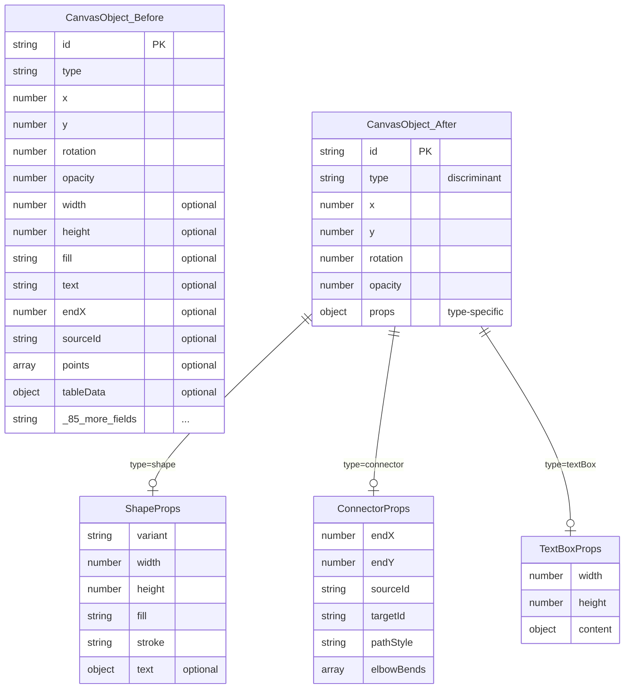

# ♻️ refactor: CanvasObject 데이터 구조 리팩토링

## Overview

현재 `CanvasObject`는 85+ 개의 optional 필드를 가진 flat 구조로, 개발자 혼란과 타입 안전성 부족을 야기합니다. tldraw 스타일의 `props` 분리 패턴을 적용하여 타입별 속성을 명확히 격리하고, IDE 자동완성 및 런타임 검증을 개선합니다.

---

## Problem Statement / Motivation

### 현재 문제점

```typescript
// 현재: 모든 속성이 flat하게 섞여있음
interface CanvasObject {
  id: string;
  type: ObjectType;
  x: number; y: number; rotation: number; opacity: number;
  // Shape 관련 (15개)
  width?: number; height?: number; fill?: string; stroke?: string; ...
  // Text 관련 (12개)
  text?: string; fontSize?: number; fontFamily?: FontFamily; ...
  // Connector 관련 (20개)
  endX?: number; sourceId?: string; pathStyle?: PathStyle; ...
  // Line 관련 (3개)
  points?: number[]; penType?: PenType; ...
  // Table 관련 (1개)
  tableData?: TableData;
  // ... 총 85+ 필드
}
```

### 구체적 이슈

| 이슈 | 영향 |
|------|------|
| `type: "rectangle"` vs `type: "shape" + shapeVariant: "rectangle"` 중복 | 코드 분기 복잡, 일관성 없음 |
| 모든 필드가 optional | IDE가 모든 필드 자동완성, 잘못된 조합 허용 |
| 70+ 곳에서 `obj.type === "..."` 체크 산재 | 새 타입 추가 시 누락 위험 |
| `Partial<CanvasObject>` API | 타입 안전성 없음 |

### 목표

1. **타입별 속성 격리** - connector에만 endX, shape에만 fill
2. **IDE 자동완성 개선** - `type` 값에 따라 유효한 속성만 제안
3. **마이그레이션 안전성** - 기존 localStorage 데이터 보존
4. **점진적 적용** - 한 번에 전체 변경하지 않음

---

## Proposed Solution

### tldraw 스타일 하이브리드 구조 (Option C 선택)

```typescript
// 공통 베이스 (모든 객체)
interface CanvasObjectBase {
  id: string;
  type: ObjectType;
  x: number;
  y: number;
  rotation: number;
  opacity: number;
  // 공통 메타
  authorId?: string;
  authorName?: string;
  locked?: boolean;
  groupId?: string;
  zIndex?: number;
}

// 타입별 props 분리
interface ShapeObject extends CanvasObjectBase {
  type: "shape";
  props: {
    variant: ShapeVariant;
    width: number;
    height: number;
    fill: string;
    fillMode: "fill" | "transparent" | "nofill";
    stroke: string;
    strokeWidth: number;
    // 텍스트 (도형 내부)
    text?: TextContent;
  };
}

interface ConnectorObject extends CanvasObjectBase {
  type: "connector";
  props: {
    endX: number;
    endY: number;
    sourceId?: string;
    targetId?: string;
    sourceAnchor?: AnchorType;
    targetAnchor?: AnchorType;
    pathStyle: PathStyle;
    lineStyle: LineStyle;
    startMarker: MarkerStyle;
    endMarker: MarkerStyle;
    elbowBends?: ElbowBend[];
    label?: TextContent;
  };
}

interface TextBoxObject extends CanvasObjectBase {
  type: "textBox";
  props: {
    width: number;
    height: number;
    content: TextContent;
  };
}

// ... 기타 타입들

// Union Type
type CanvasObject =
  | ShapeObject
  | ConnectorObject
  | TextBoxObject
  | LineObject
  | ImageObject
  | TableObject
  | StickyNoteObject;
```

### 선택 이유

| 기준 | Option A (Nested) | Option B (Full Union) | **Option C (props)** |
|------|---|---|---|
| 기존 API 호환성 | 높음 | 낮음 | **중간** |
| 타입 안전성 | 낮음 | 최고 | **높음** |
| 마이그레이션 복잡도 | 낮음 | 높음 | **중간** |
| IDE 자동완성 | 보통 | 최고 | **좋음** |

---

## Technical Approach

### Architecture

```
src/types/
├── base.ts           # CanvasObjectBase, Transform, Meta
├── shape.ts          # ShapeObject, ShapeProps
├── connector.ts      # ConnectorObject, ConnectorProps
├── textbox.ts        # TextBoxObject, TextBoxProps
├── line.ts           # LineObject, LineProps
├── image.ts          # ImageObject, ImageProps
├── table.ts          # TableObject, TableProps
├── sticky-note.ts    # StickyNoteObject, StickyNoteProps
├── text-content.ts   # TextContent (tiptap wrapper)
└── index.ts          # Union export

src/schemas/
├── base.ts           # BaseObjectSchema
├── shape.ts          # ShapeObjectSchema
├── connector.ts      # ConnectorObjectSchema
└── index.ts          # z.discriminatedUnion
```

### ERD (Before → After)



---

## Implementation Phases

### Phase 1: 기반 작업 (데이터 안전성 우선)

**목표:** 마이그레이션 안전성 확보 + Type Guard 함수 추가

#### Tasks

- [ ] `src/store/index.ts` - Zod 검증 순서 수정 (migrate 이후로 이동)
- [ ] `src/utils/typeGuards.ts` - Type predicate 함수 추가
- [ ] `src/types/index.ts` - 기존 타입은 유지, 새 구조 타입 병행 정의

#### src/store/index.ts (마이그레이션 순서 수정)

```typescript
function createValidatingStorage<T>(): PersistStorage<T> {
  return {
    getItem: (name: string): StorageValue<T> | null => {
      const str = localStorage.getItem(name);
      if (!str) return null;

      try {
        const raw = JSON.parse(str);

        // 1. migrate가 먼저 실행될 수 있도록 raw 데이터 반환
        // 2. Zod 검증은 migrate 이후 partialize된 상태에서 수행
        return {
          state: raw.state as T,
          version: raw.version,
        };
      } catch (e) {
        console.error("[Canvas Store] localStorage 파싱 실패:", e);
        return null;
      }
    },
    // ...
  };
}

// migrate 함수 내에서 Zod 검증 추가
migrate: (persistedState, version) => {
  let state = persistedState as PersistedStateLegacy;

  // 기존 마이그레이션...
  if (version < 2) { /* v1 -> v2 */ }
  if (version < 3) { /* v2 -> v3 */ }
  if (version < 4) { /* v3 -> v4: props 분리 */ }

  // 마이그레이션 후 검증
  const result = validatePersistedState(state);
  if (!result.success) {
    console.warn("[Canvas Store] 마이그레이션 후 검증 실패:", result.error);
    // 여기서는 경고만, 데이터는 유지
  }

  return state;
}
```

#### src/utils/typeGuards.ts

```typescript
import type { CanvasObject } from "@/types";

// Type predicate 함수들
export function isShape(obj: CanvasObject): obj is CanvasObject & { type: "shape" | "rectangle" } {
  return obj.type === "shape" || obj.type === "rectangle";
}

export function isConnector(obj: CanvasObject): obj is CanvasObject & { type: "connector" } {
  return obj.type === "connector";
}

export function isTextBox(obj: CanvasObject): obj is CanvasObject & { type: "textBox" } {
  return obj.type === "textBox";
}

export function isLine(obj: CanvasObject): obj is CanvasObject & { type: "line" } {
  return obj.type === "line";
}

export function isTable(obj: CanvasObject): obj is CanvasObject & { type: "table" } {
  return obj.type === "table";
}

export function isStickyNote(obj: CanvasObject): obj is CanvasObject & { type: "stickyNote" } {
  return obj.type === "stickyNote";
}

export function isImage(obj: CanvasObject): obj is CanvasObject & { type: "image" } {
  return obj.type === "image";
}

export function hasTextContent(obj: CanvasObject): boolean {
  return obj.tiptapContent !== undefined || obj.text !== undefined;
}
```

**Estimated effort:** 1-2일

---

### Phase 2: `rectangle` 타입 통합

**목표:** `type: "rectangle"`을 `type: "shape", shapeVariant: "rectangle"`로 통합

#### Tasks

- [ ] `src/types.ts` - ObjectType에서 "rectangle" 제거 (deprecate 먼저)
- [ ] `src/utils/factory.ts` - `createRectangle()` → `createShape("rectangle")` 위임
- [ ] `src/store/index.ts` - v4 마이그레이션 함수 추가
- [ ] 코드베이스 전체 `type === "rectangle"` → `isShape(obj)` 교체

#### v4 마이그레이션 함수

```typescript
if (version < 4) {
  // v3 -> v4: rectangle을 shape로 통합
  state = {
    ...state,
    objects: state.objects?.map((obj: CanvasObject) => {
      if (obj.type === "rectangle") {
        return {
          ...obj,
          type: "shape",
          shapeVariant: "rectangle",
        };
      }
      return obj;
    }) ?? [],
    // pages 내부 objects도 처리
    pages: state.pages?.map((page) => ({
      ...page,
      objects: page.objects.map((obj) => {
        if (obj.type === "rectangle") {
          return { ...obj, type: "shape", shapeVariant: "rectangle" };
        }
        return obj;
      }),
    })) ?? [],
  };
}
```

**Estimated effort:** 2-3일

---

### Phase 3: props 객체 분리

**목표:** 타입별 속성을 `props` 객체로 격리

#### Tasks

- [ ] `src/types/` 디렉토리 생성 및 타입별 파일 분리
- [ ] `src/schemas/` Zod 스키마 discriminatedUnion 적용
- [ ] `src/utils/factory.ts` - create 함수들 반환 타입 변경
- [ ] v5 마이그레이션 함수 (flat → props 변환)

#### src/types/shape.ts

```typescript
import type { CanvasObjectBase } from "./base";
import type { TextContent } from "./text-content";
import type { ShapeVariant } from "./enums";

export interface ShapeProps {
  variant: ShapeVariant;
  width: number;
  height: number;
  fill: string;
  fillMode: "fill" | "transparent" | "nofill";
  stroke: string;
  strokeWidth: number;
  text?: TextContent;
  isTextExpanded?: boolean;
}

export interface ShapeObject extends CanvasObjectBase {
  type: "shape";
  props: ShapeProps;
}
```

#### v5 마이그레이션 함수

```typescript
if (version < 5) {
  // v4 -> v5: flat → props 분리
  state = {
    ...state,
    objects: state.objects?.map((obj) => convertToPropsStructure(obj)) ?? [],
    pages: state.pages?.map((page) => ({
      ...page,
      objects: page.objects.map(convertToPropsStructure),
    })) ?? [],
  };
}

function convertToPropsStructure(obj: LegacyCanvasObject): CanvasObject {
  switch (obj.type) {
    case "shape":
      return {
        id: obj.id,
        type: "shape",
        x: obj.x,
        y: obj.y,
        rotation: obj.rotation,
        opacity: obj.opacity,
        props: {
          variant: obj.shapeVariant ?? "rectangle",
          width: obj.width ?? 100,
          height: obj.height ?? 100,
          fill: obj.fill ?? "#ffffff",
          fillMode: obj.fillMode ?? "fill",
          stroke: obj.stroke ?? "#000000",
          strokeWidth: obj.strokeWidth ?? 2,
          text: obj.tiptapContent ? { content: obj.tiptapContent } : undefined,
        },
        // meta
        authorId: obj.authorId,
        authorName: obj.authorName,
        locked: obj.locked,
        groupId: obj.groupId,
        zIndex: obj.zIndex,
      };
    case "connector":
      return {
        id: obj.id,
        type: "connector",
        x: obj.x,
        y: obj.y,
        rotation: obj.rotation,
        opacity: obj.opacity,
        props: {
          endX: obj.endX ?? obj.x,
          endY: obj.endY ?? obj.y,
          sourceId: obj.sourceId,
          targetId: obj.targetId,
          // ... 기타 connector props
        },
      };
    // ... 기타 타입들
  }
}
```

**Estimated effort:** 5-7일

---

### Phase 4: 컴포넌트 API 업데이트

**목표:** OptionsBar 컴포넌트들의 prop 타입 개선

#### Tasks

- [ ] `*OptionsBar.tsx` - `onUpdate` prop 타입을 타입별로 좁힘
- [ ] `src/store/index.ts` - `updateObject` 액션 시그니처 개선
- [ ] equality 함수 props 구조 대응

#### 컴포넌트 prop 타입 개선

```typescript
// Before
interface ShapeOptionsBarProps {
  shape: CanvasObject;
  onUpdate: (updates: Partial<CanvasObject>) => void;
}

// After
interface ShapeOptionsBarProps {
  shape: ShapeObject;
  onUpdate: (updates: Partial<ShapeProps>) => void;
}
```

#### Store updateObject 개선

```typescript
// 유틸리티 타입
type UpdatePayload<T extends CanvasObject> =
  T extends { props: infer P } ? Partial<P> : never;

// 액션
updateObjectProps: <T extends CanvasObject>(
  id: string,
  updates: UpdatePayload<T>
) => void;
```

**Estimated effort:** 3-5일

---

## Acceptance Criteria

### Functional Requirements

- [ ] 기존 localStorage 데이터가 v5로 정상 마이그레이션됨
- [ ] 모든 도형/커넥터/텍스트박스 기능이 정상 동작
- [ ] Undo/Redo가 정상 동작
- [ ] Copy/Paste가 정상 동작
- [ ] 페이지 전환 시 데이터 유지

### Non-Functional Requirements

- [ ] 마이그레이션 실패 시 데이터 소실 없음 (fallback)
- [ ] TypeScript strict 모드에서 컴파일 에러 없음
- [ ] 라이브러리 빌드 (`npm run build:lib`) 성공

### Quality Gates

- [ ] Zod 스키마와 TypeScript 타입 동기화 확인
- [ ] `obj.type === "..."` 직접 체크 → type guard 함수로 교체 완료
- [ ] 중복 코드 (clipboard.ts 등) 헬퍼로 추출

---

## Dependencies & Prerequisites

- [x] Zod 라이브러리 설치 완료 (`zod: ^4.3.6`)
- [x] Zod 스키마 기본 구조 완료 (`src/schemas/`)
- [ ] Phase 1 완료 후 Phase 2 진행 (순차적)

---

## Risk Analysis & Mitigation

| 리스크 | 확률 | 영향 | 완화 방안 |
|--------|------|------|----------|
| localStorage 마이그레이션 실패 | 중 | 높음 | Zod 검증을 migrate 이후로 이동, fallback 로직 |
| `rectangle` 타입 누락 객체 발생 | 낮 | 중 | 마이그레이션 후 검증 로그 |
| OptionsBar 컴포넌트 런타임 에러 | 중 | 중 | 점진적 마이그레이션, 타입 guard 선행 |
| 라이브러리 소비자 breaking change | 중 | 높음 | Semver major 버전 증가, CHANGELOG |

---

## References & Research

### Internal References

- 현재 타입 정의: `src/types.ts:209-295`
- 현재 Zod 스키마: `src/schemas/canvasObject.ts`
- 마이그레이션 함수: `src/store/index.ts:381-451`
- Type guards: `src/utils/typeGuards.ts`

### External References

- [Excalidraw 타입 구조](https://github.com/excalidraw/excalidraw/blob/master/packages/element/src/types.ts)
- [tldraw 스키마 설계](https://github.com/tldraw/tldraw/blob/main/packages/tlschema/DOCS.md)
- [Zod Discriminated Unions](https://zod.dev/?id=discriminated-unions)
- [TypeScript Narrowing](https://www.typescriptlang.org/docs/handbook/2/narrowing.html)

### Related Work

- Zod 스키마 적용: 이번 세션에서 완료
- 라이브러리 빌드: `pig-ma-0.1.0.tgz` 생성 완료

---

## Decisions Made

### 1. `connectorLabel` 처리 방향: **connector.props.label로 이동**

- 독립 객체(`type: "connectorLabel"`)를 connector 내부로 통합
- `ConnectorProps.label?: TextContent` 형태로 포함
- v5 마이그레이션에서 connectorLabel 객체를 해당 connector의 props.label로 병합

### 2. `ElbowBend` 구조 정리: **이번 리팩토링에 포함**

- 12개 optional 필드 정리
- 레거시/deprecated 필드 제거
- 간소화된 구조로 재설계 (Phase 3에 추가)

### 3. Type/Schema 단일 소스: **Zod에서 타입 추론 (`z.infer<>`)**

- Zod 스키마가 Single Source of Truth
- TypeScript 타입은 `z.infer<typeof Schema>`로 도출
- `src/types/` 파일들은 `src/schemas/`에서 추론된 타입만 re-export

```typescript
// src/schemas/shape.ts
export const ShapeObjectSchema = z.object({ ... });
export type ShapeObject = z.infer<typeof ShapeObjectSchema>;

// src/types/index.ts
export type { ShapeObject } from "@/schemas/shape";
```

---

## Updated Implementation Phases

위 결정에 따라 다음 작업이 추가됩니다:

### Phase 2 추가 작업
- [ ] `ElbowBend` 인터페이스 간소화 (레거시 필드 정리)

### Phase 3 추가 작업
- [ ] `connectorLabel` 타입을 `connector.props.label`로 마이그레이션
- [ ] Zod 스키마를 Single Source of Truth로 전환
- [ ] `src/types/*.ts` 파일들이 `src/schemas/`에서 타입 추론

### Phase 3 마이그레이션 함수 업데이트

```typescript
// v5 마이그레이션에서 connectorLabel 병합
if (version < 5) {
  const connectorLabels = state.objects?.filter(o => o.type === "connectorLabel") ?? [];
  const otherObjects = state.objects?.filter(o => o.type !== "connectorLabel") ?? [];

  state = {
    ...state,
    objects: otherObjects.map((obj) => {
      if (obj.type === "connector") {
        // 해당 connector에 연결된 label 찾기
        const label = connectorLabels.find(l => l.connectedConnectorId === obj.id);
        return convertToPropsStructure({
          ...obj,
          // label 정보 병합
          _mergedLabel: label,
        });
      }
      return convertToPropsStructure(obj);
    }),
  };
}
```

---

*Generated with Claude Code*
